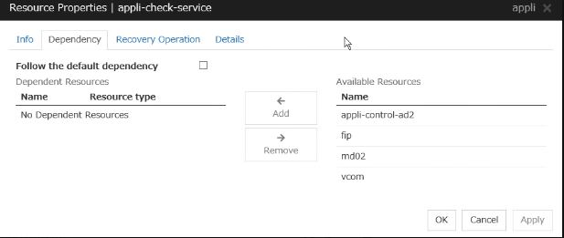
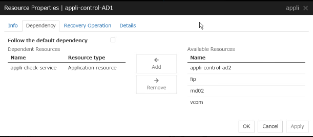
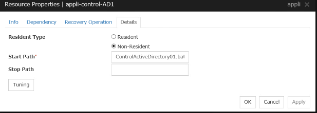
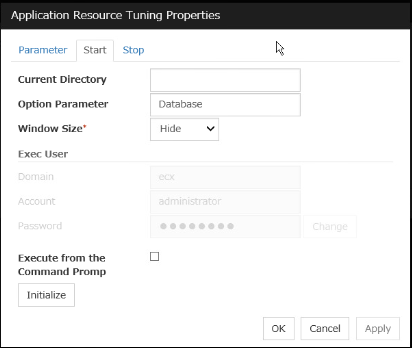
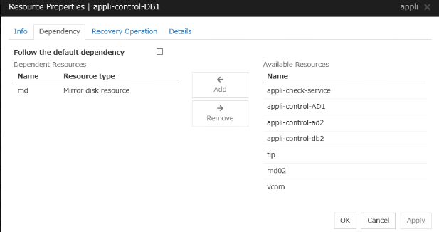
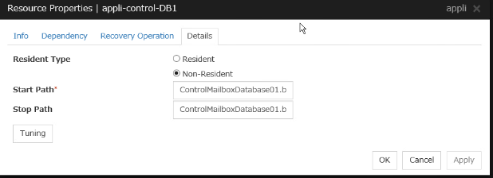
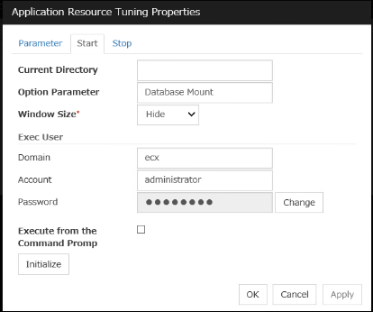
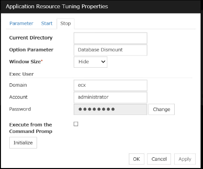
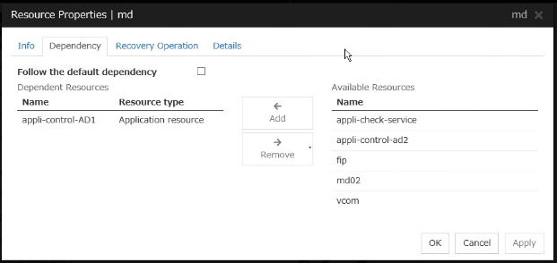
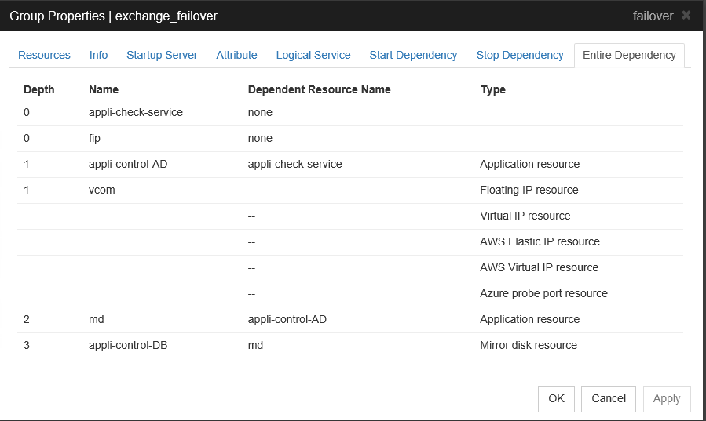

# Microsoft Exchange Server 2019 (CU9) on Windows Cluster ECX 4.3
This page describes how to create an Exchange Server 2019 cluster with EXPRESSCLUSTER X.

- For more information regarding EXPRESSCLUSTER X, please visit [this site](https://www.nec.com/en/global/prod/expresscluster/en/support/manuals.html).

## Exchange 2019 Prerequisites 

For more information on preparing Active Directory and Windows Server 2019 for Exchange Server 2019, please see Microsoft documentation at [this site](https://docs.microsoft.com/en-us/exchange/plan-and-deploy/prerequisites?view=exchserver-2019).

[Alternative Link](https://msexperttalk.com/part-2-install-and-configure-exchange-server-2019/)

## System Configuration
- Servers: 2 nodes with 1 Mirror Disk each
- OS: Windows Server 2019
- SW:
	- Exchange Server 2019 CU 9
	- EXPRESSCLUSTER X 4.0/4.1/4.2/4.3

```bat
<Public LAN>
 |
 | <Private LAN>
 |  |
 |  |  +--------------------------------+
 +-----| Primary Server                 |
 |  |  |  Windows Server 2019           |
 |  |  |  EXPRESSCLUSTER X 4.3          |
 |  +--|  Exchange Server 2019          |
 |  |  +--------------------------------+
 |  |
 |  |  +--------------------------------+
 +-----| Secondary Server               |
 |  |  |  Windows Server 2019           |
 |  |  |  EXPRESSCLUSTER X 4.3          |
 |  +--|  Exchange Server 2019          |
 |  |  +--------------------------------+
 |  |
 |  |
 |  |  +--------------------------------+
 |  +--| Client machine                 |
 |     +--------------------------------+
 |
[Gateway]
 :
```


### Requirements
- The Primary Server, Secondary Server and Client machine should be reachable via IP addresses.
- In order to use the fip resource, both servers should belong to the same nework.
	- If each server belongs to a different network, you can use a [ddns resource](https://www.manuals.nec.co.jp/contents/system/files/nec_manuals/node/539/W43_RG_EN/W_RG_03.html#understanding-dynamic-dns-resources) with [Dynamic DNS Server](https://github.com/EXPRESSCLUSTER/Tips/blob/master/ddnsPreparation.md) instead of an fip address.
- Ports which EXPRESSCLUSTER requires should be opened.
	- You can open ports by executing OpenPort.bat([X4.1](https://github.com/EXPRESSCLUSTER/Tools/blob/master/OpenPorts.bat)/[X4.2 and X4.3](https://github.com/EXPRESSCLUSTER/Tools/blob/master/OpenPorts_X42.bat)) on both servers.
- 2 partitions are required, one for Mirror Disk Data Partition and one for Cluster Partition.
	- Data Partition: Depends on mirrored data size (NTFS)
	- Cluster Partition: 1GB, RAW (do not format this partition)
	- **Note**
		- It is not supported to mirror the C: drive and please do NOT specify C: for the Data Partition.
		- Dynamic disk is not supported for Data Partition and Cluster Partition.
		- Data on the Secondary Server's Data Partition will be overwritten for initial Mirror Disk synchronization (Initial Recovery).
		
		
### Sample Configuration
- Primary/Secondary Server
	- OS: Windows Server 2019
	- EXPRESSCLUSTER X: 4.2 or 4.3
	- CPU: 2
	- Memory: 8GB
	- Disk
		- Disk0: System Drive
			- C:
		- Disk1: Mirror Disk
			- X:
			        Cluster Partition
				- Size: 1GB
				- File system: RAW (do NOT format)
			- E:
			        Data Partition
				- Size: Depending on data size
				- File system: NTFS
- Required Licenses
	- Core: For 4CPUs
	- Replicator Option: For 2 nodes
	- (Optional) Other Option licenses: For 2 nodes

- IP address  

  | |Public IP |Private IP |
  |-----------------|-----------------|-----------------|
  |Primary Server |10.0.7.11 |192.168.1.11 |
  |Secondary Server |10.0.7.12 |192.168.1.12 |
  |fip |10.0.7.21 |- |
  |Client |10.0.7.51 |- |
  |Gateway |10.0.7.1 |- |

## Cluster Configuration
- failover group
	- fip
	- vcom (optional)
	- md
		- Cluster Partition: X drive
		- Data Partition: E drive
	- application resource 1
	    - Exchange application resource to check if all Exchange services are running
	- application resource 2
	    - Exchange application resource to change AD parameters for a mailbox database
	- application resource 3
	    - Exchange application resource to control a Mailbox Database
		
	
## Setup
This section describes how to set up an Exchange Server with EXPRESSCLUSTER 4.3. 

### Set up a Basic Cluster
Please refer to [Basic Cluster Setup](https://github.com/EXPRESSCLUSTER/BasicCluster/blob/master/X41/Win/2nodesMirror.md).   
- vcom [setup info here](https://www.manuals.nec.co.jp/contents/system/files/nec_manuals/node/539/W43_RG_EN/W_RG_03.html#understanding-virtual-computer-name-resources).

### Install Exchange 2019 Server

For Exchange installation and configuration, please visit [this Microsoft site](https://docs.microsoft.com/en-us/exchange/plan-and-deploy/deploy-new-installations/deploy-new-installations?view=exchserver-2019).

[Alternative link](https://msexperttalk.com/part-4-install-and-configure-exchange-server-2019/)

### 1.1 Modify the Powershell script execution policy to execute the script
  
1. Launch **PowerShell** on the **Primary Server**.
 
2. Use _Get-ExecutionPolicy_ to check the current server's script execution policy.
 
3. Set the execution policy to **RemoteSigned** or **Unrestricted** using _Set-ExecutionPolicy_ in order to run EC failover scripts.
         
		PS> Set-ExecutionPolicy RemoteSigned

- Repeat this process on the **Standby Server**.

### 1.2 Make a duplicate copy of RemoteExchange.ps1 and modify the copy

1. Navigate to the Exchange ‘Bin’ folder (e.g. C:\Program Files\Microsoft\Exchange Server\V15\Bin) on the **Primary Server**.
 
2. Make a duplicate Copy of **RemoteExchange.ps1** to the same folder and rename the copy to **RemoteExchange-ECX.ps1**.
 
3. Edit **RemoteExchange-ECX.ps1** by scrolling down to the section where the functions are called and commenting out **get-banner** and **get-tip**. Then add the error handling code with the line _.\ControlMailboxDatabase.ps1_ as shown in the example below: 
````   
      ## now actually call the functions

      #get-exbanner
      #get-tip
      $ErrorControlMailboxDatabase = 90
      .\ControlMailboxDatabase.ps1
      $bRet = $?
      if ($bRet –eq $False)
      {
      exit $ErrorControlMailboxDatabase
      }
````
4. Repeat this process on the **Standby Server**.

## Cluster Setup 

- Confirm that the **%failover group%** is active on the **Primary Server** and perform the following step on the **Primary Server**.

### 2.1 Move the Mailbox Database to the Mirror Disk    
**Note** - This is a good opportunity to rename the mailbox database from the long default name.
1. Create a folder (Mailbox Folder) on the Mirror Disk **Data Partition** (example: _E:\Mailbox Folder_).
2. Before moving the Mailbox Database and LogFolderPath, make a backup copy of all files to be moved.
3. Once the backup is made, open **Exchange Management Shell** as administrator.
4. Run the following command at the prompt:
````
      Move-DatabasePath –Identity <MDB name> -EdbFilePath <new path to .edb file> -LogFolderPath <new path to folder>
      
      Example: Move-DatabasePath –Identity “LongfilenameMailbox” –EdbFilePath “E:\Mailbox Folder\Mailbox01.edb” –LogFolderPath “E:\Mailbox Folder”
````
5. Next run the following command at the prompt:    

	   Set-MailboxDatabase –Identity <MDB name> –MountAtStartup $False

7. To verify the change, run the command:

	   Get-MailboxDatabase <MDB name> | Fl Name,*Path*

### 2.2 Check and stop service Microsoft Exchange Search Host Controller on both servers.

1. Right-click **Start** on the desktop and then click **Run** on the **Primary Server** (Machine 1).
2. Type **services.msc** and click **OK** to open the **Services** management console.
3. Right-click on the service **Microsoft Exchange Search Host Controller** and then select **Properties**.
4. Set the **Startup type** to **Disabled** and then **Stop** the service.
5. Repeat this process on the **Standby Server** (Machine 2).

### 2.3 Copy and configure failover scripts

1. Download the script files from the **Exchange Server** section of the [NEC EXPRESSCLUSTER web site](http://www.nec.com/en/global/prod/expresscluster/en/support/Setup.html). 
2. Copy all script files to the **EXPRESSCLUSTER bin** folder (example. _C:\ProgramFiles\EXPRESSCLUSTER\bin_) on the **Primary Server**.
3. Open **SetEnvironment.bat** with a text editor and change the parameters to match your environment.
4. Repeat the previous two steps on the **Standby Server**.

    **Note** - 
				
    One of the scripts requires that the **Active Directory module for Windows PowerShell** feature is installed. Verify this on both servers before continuing by opening the **Add Roles and Features Wizard**, and from **Features** check the following: _Remote Server Administration Tools > Role Administration Tools > AD DS and AD LDS Tools > Active Directory Module for Windows PowerShell_.

### 2.4 Add Application Resources in ECX cluster to Control an Exchange Mailbox Database 
  
**STEP :- 1**

### Adding 1st application resource [example: appli-check-service]

1. Start the ECX Cluster webui manager.

2. In the **Cluster Manager** window, choose **Config mode**.

3. Click on the "+" symbol to the right of the **%failover group%** to add the first (1st) application resource.
  
4. From the drop down list, select **Application resource** for **Type**, and give a name to the resource (example: _appli-check-service_). Click **Next**.

5. Uncheck **Follow the default dependency** and click **Next**.

6. Click **Next** if the default values are acceptable. Make changes to **Retry Count** or **Failover Threshold** first if necessary.

7. Select **Non-Resident** and set the following parameter for **Start Path**:
  ```
  Start Path    : CheckExchangeServices01.bat
  Stop Path     : (NULL)
  Resident Type : Non-Resident
  ```

<p align="center">

</p>

8. Click **Tuning** and set **0** for **Normal Return Value**. Set a **Timeout** value of at least **3600** for **Start** on the **Parameter** tab (see Note below). Click **OK** and then click **Finish**.
  
 **Note**
  ```
  The 1st application resource (example. appli-check-service) uses the following parameters in SetEnvironment.bat to wait
  for all Exchange services to be running.
        RetryCount : 30
        RetryInterval : 60
  By default, the application resource waits 1800 (= RetryCount x RetryInterval)seconds for all Exchange services to be running. 
  If any services are not running, the application resource starts them and waits 1800 seconds for them to be running. Services
  can take up to 3600 seconds to start. 
  It is recommended to set the Timeout value to 3600 or longer (= RetryCount x RetryInterval + some buffer).
  ```
	
**STEP :-2**
### Adding 2nd application resource [example: appli-control-AD]

1. Click on the "+" to the right of the **%failover group%** to add the second (2nd) application resource.

2. From the drop down list, select **Application resource** for **Type**, and give a name to the resource (example: _appli-control-AD_). Click **Next**.

3. Uncheck **Follow the default dependency**. Click the first application resource (example: _appli-check-service_) and click **Add**. Click **Next**.

 <p align="center">

</p>   

4. Click **Next** if the default values are acceptable. Make changes to **Retry Count** or **Failover Threshold** first if necessary.
  
5. Select **Non-Resident** and set the following parameter for **Start Path**:
    ```
    Start Path : ControlActiveDirectory01.bat 
    Stop Path : (NULL)
    ```

<p align="center">

</p>   
	
6. Click **Tuning** and set **0** for **Normal Return Value** of **Start** on the **Parameter** tab.

7. In the **Tuning** page click on **Start** tab and enter the mailbox database name in the **Option Parameter** field.
             
		Option Parameter : <Mailbox database name> example: DB1

<p align="center">

</p>

8. Click the **Start** tab and set the following parameters:
    ```  
    Domain   : your domain name
    Account  : a user belonging to the Schema Admins group
    Password : password for the above user
    ```
9. Click **OK** and then click **Finish**.


**STEP :-3** 

### Adding 3rd application resource [example: appli-control-DB]

1. Click the "+" symbol to the right of the **%failover group%** to add the third (3rd) application resource.

2. From the drop down list, select **Application resource** for **Type**, and give a name to the resource (example: _appli-control-DB_). Click **Next**.
  
3. Uncheck **Follow the default dependency**. Click the mirror disk resource and click **Add**. Click **Next**.

  <p align="center">
  
  </p>
  
4. Click **Next** if the default values are acceptable. Make changes to **Retry Count** or **Failover Threshold** first if necessary.
   
5. Select **Non-Resident** and set the following parameters for **Start Path** and **Stop Path**:
    ```          
    Start Path : ControlMailboxDatabase01.bat 
    Stop Path : ControlMailboxDatabase01.bat 
    ```
	
  <p align="center">
  
  </p>		
				 
6. Click **Tuning** and set **0** for **Normal Return Value** of both **Start** and **Stop** on the **Parameter** tab.

7. Click the **Start** tab and set the following parameters:
    ```
    Option parameter: <Mailbox database name> Mount
    Domain          : your domain name
    Account         : a user belonging to the Organization Management group
    Password        : password of the above user
    ```
		
  <p align="center">
  
  </p>		
		 
8. Click the **Stop** tab and set the following parameters:
    ```
    Option parameter: <Mailbox database name> Dismount
    Domain          : your domain name
    Account         : a user belonging to the Organization Management group
    Password        : password of the above user
    ```
    
  <p align="center">
  
  </p>	
  
9. Click **OK** and then click **Finish**.

**Mirror Disk Resource  dependency**

1. Click on the gear with a pencil icon to the right of the mirror disk resource (md).

2. Select the **Dependency** tab and uncheck **Follow the default dependency**. Select the newly created _appli-control-AD_ resource and click **Add**.

3. Click **OK**.  
  
  <p align="center">
  
  </p>


###  Entire Dependency reference snippet.

Please refer to the image below to review the dependencies.
  
   <p align="center">
  
  </p>

## 2.4 Upload the cluster configuration and start the cluster.


1. First dismount the mailbox database using **Exchange Administrative Center** or the following command in the **Exchange Management Shell** before starting the cluster:
        
	      Dismount-Database –Identity <Mailbox database name>

2. Then in the Cluster Manager window, click **Apply the Configuration File**. Click **OK**. 

3. Click **OK**.

4. After the upload is complete, change to the **Operation mode**.

5. If the **%failover group%** is not running, click on the triangle icon (Start Group) button below the **Primary Server**'s column. You also may need to start each of the three new services the same way. Once all resources are started, the mailbox database will mount on this server and email clients can now connect.


**Note** -   

In the case that the **appli-check-service** fails or takes too long to start, start services.msc on the active server and ensure that all Exchange services are running automatically. Start all services that should be running. You can also check **scrpl0** logs (_C:\Program Files\EXPRESSCLUSTER\log_) for troubleshooting help.

There is no need to make changes to Microsoft Outlook or OWA.

## Testing Cluster Functionality
	   
1. Move the **%failover group%** to the **Standby Server**. Monitor the failover process in the Cluster Manager window. Verify that email clients are still able to
   connect to the mailbox database.
   
2. Move the **%failover group%** back to the **Primary Server**. Verify that email clients are still able to connect to the mailbox database.


